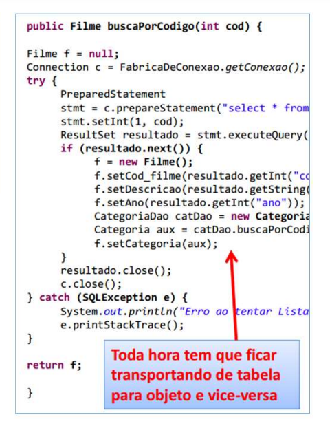
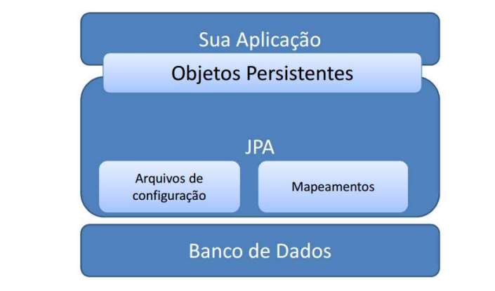

## Nivelamento: mapeamento objeto-relacional com JPA / Hibernate 

- 1) Visão geral sobre mapeamento objeto-relacional
1) 
Por vários anos a maior dificuldade de se usar a abordagem OO foi a comunicação com o BD Relacional.
O BD não é orientado a Objetos ele tem outro paradigma que é o paradigma Relacional, Ou seja quando faziamos
um sistema OO com as nossas classes associadas e tudo mais, quando tínhamos que trabalhar com esses objetos
no BD o esforço era enorme para programar essa interação entre dois paradigmas diferentes

Quando usávamos o pacote JDBC tinhamos que programar a tradução do BD Relacional para as nossas classes Orientadas a Objetos.
Ou seja toda hora tinha que transportar de tabela para Objeto e de Objeto para Tabela.

Antes de Existir as ferramentas de Mapeamento Objeto Relacional a programação era custosa devido essa tradução de Objeto Relacional
e vice e versa

- 2) Outros problemas que devem ser tratados:
1) Contexto de persistência (objetos que estão ou não atrelados a uma conexão em um dado momento)
2) Mapa de identidade (cache de objetos já carregados)
3) Carregamento tardio (lazy loading)
4) Outros 

As ferramentas de Objeto Relacional faz automaticamente, ou seja elas vieram para melhorar a comunicação de um Sistema OO
com um BD Relacional.

##  JPA

JAVA EE: Java Enterprise Edition é conjunto de especificações e a mais importante é a JPA.

Java Persistence API (JPA) é a especificação padrão da plataforma Java EE (pacote javax.persistence) para
mapeamento objeto-relacional e persistência de dados

JPA é apenas uma especificação (JSR 338):

- http://download.oracle.com/otn-pub/jcp/persistence-2_1-fr-eval-spec/JavaPersistence.pdf

Hibernate é uma das implementações do JPA.

Para trabalhar com JPA é preciso incluir no projeto uma implementação da API (ex: Hibernate e outras).

O JPA é a especificação/interface e o Hibernate é a implementação.

Arquitetura de uma aplicação que utiliza JPA: 

Principais classes da JPA:

1) EntityManager

https://docs.oracle.com/javaee/7/api/javax/persistence/EntityManager.html

Um objeto EntityManager encapsula uma conexão com a base de dados e serve para efetuar operações de
acesso a dados (inserção, remoção, deleção, atualização) em entidades (clientes, produtos, pedidos, etc.)
por ele monitoradas em um mesmo contexto de persistência. 
(instanciar o EntityManger é a grosso modo conectar com o BD  )

Escopo: tipicamente mantem-se uma instância única de EntityManager para cada thread do sistema (no caso
de aplicações web, para cada requisição ao sistema). Ou seja quando o usuário está utilizando uma aplicação web
e ele faz uma requisição essa aplicação vai instanciar um único EntityManager para trabalhar com todos os dados
daquela requisição.

2) EntityManagerFactory 

https://docs.oracle.com/javaee/7/api/javax/persistence/EntityManagerFactory.html

Um objeto EntityManagerFactory é utilizado para instanciar objetos EntityManager.

Escopo: tipicamente mantem-se uma instância única de EntityManagerFactory para toda aplicação.

## Incluindo JPA para persistir os objetos em banco de dados

-  Configure o JPA no seu projeto por meio do arquivo persistence.xml

     Crie uma pasta "META-INF" a partir da pasta "resources"
     Dentro da pasta META-INF crie um arquivo "persistence.xml"
     Conteúdo do arquivo persistence.xml:

<?xml version="1.0" encoding="UTF-8"?>
<persistence xmlns="http://xmlns.jcp.org/xml/ns/persistence"
xmlns:xsi="http://www.w3.org/2001/XMLSchema-instance"
xsi:schemaLocation="http://xmlns.jcp.org/xml/ns/persistence
http://xmlns.jcp.org/xml/ns/persistence/persistence_2_1.xsd" version="2.1">
    <persistence-unit name="exemplo-jpa" transaction-type="RESOURCE_LOCAL">
        <properties>
            <property name="javax.persistence.jdbc.url"
            value="jdbc:mysql://localhost:3306/aulajpa?useSSL=FALSE&amp;serverTimezone=UTC" />
            <property name="javax.persistence.jdbc.driver" value="com.mysql.jdbc.Driver" />
            <property name="javax.persistence.jdbc.user" value="root" />
            <property name="javax.persistence.jdbc.password" value="" />
            <property name="hibernate.hbm2ddl.auto" value="update" />
            
             <property name="hibernate.dialect" value="org.hibernate.dialect.MySQL8Dialect" />
         </properties>
     </persistence-unit>
</persistence> 

## Observação

JPA só consegue remover uma instancia que está monitorada, quando ela está detach não é possivel remover.

Objeto monitorado é um objeto que você acabou de inserir, ou um objeto que você buscou do BD .

## Tecnologias Projeto

- JPA
- Hibernate
- Postman
- Maven
- 
